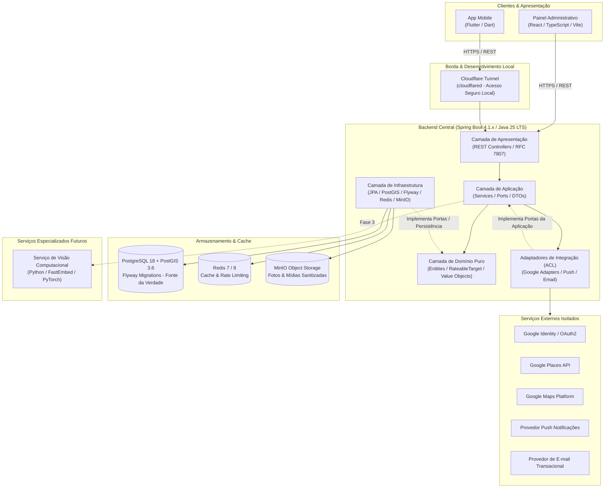
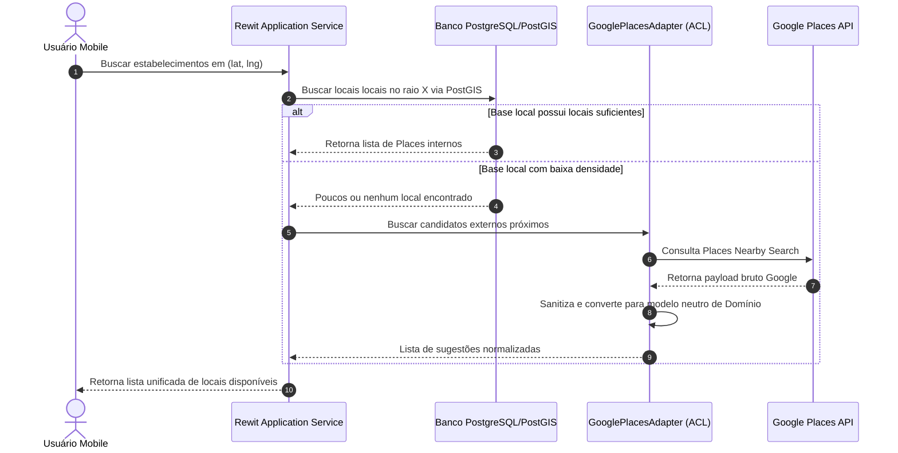

# REWIT - ARQUITETURA DE SOFTWARE (ARCHITECTURE.md)

---

## 1. Visão Geral do Sistema

O **Rewit** é construído sob uma arquitetura modular moderna orientada a serviços desacoplados e baseada nos princípios de **Clean Architecture (Hexagonal / Portas e Adaptadores)**.

A plataforma suporta múltiplos clientes (aplicativo mobile multiplataforma e painel administrativo web) consumindo uma API RESTful central de alta performance construída em Java / Spring Boot, com persistência relacional e espacial no PostgreSQL/PostGIS, cache de sessão e feeds em Redis, e armazenamento de objetos em MinIO (S3-compatible).



---

## 2. Estrutura do Repositório (Modular Monorepo)

O projeto é organizado no padrão de repositório único modular (*Modular Monorepo*), mantendo todos os componentes do ecossistema sincronizados, versionados e com regras arquiteturais compartilhadas:

```
/
├── apps/
│   ├── mobile/                # Aplicação cliente Flutter (iOS / Android)
│   └── admin/                 # Painel administrativo web (React / TypeScript / Vite)
│
├── backend/                   # API REST Central (Java 25 LTS / Spring Boot 4.1.x)
│   ├── src/
│   │   ├── main/
│   │   │   ├── java/com/rewit/
│   │   │   │   ├── presentation/      # REST Controllers, DTOs de entrada/saída, validações
│   │   │   │   ├── application/       # Serviços, orquestração e portas (application/port)
│   │   │   │   ├── domain/            # Entidades puras (RateableTarget), enums, value objects
│   │   │   │   ├── infrastructure/    # Adaptadores JPA, PostGIS, integração (infrastructure/integration)
│   │   │   │   ├── config/            # Beans de configuração Spring (Security, Cache, OpenApi)
│   │   │   │   └── common/            # Respostas padronizadas, tratamento global de erros RFC 7807
│   │   │   └── resources/             # application.yml, migrations Flyway (db/migration)
│   │   └── test/                      # Testes unitários, de invariantes e validação de schema
│   └── pom.xml                        # Gerenciamento de dependências Maven
│
├── services/
│   └── vision/                # Serviço futuro de inteligência visual e embeddings (Python)
│
├── infrastructure/
│   ├── docker/                # Dockerfiles de build de cada serviço
│   ├── cloudflare/            # Configurações do túnel local cloudflared
│   └── postgres/              # Scripts de inicialização do PostGIS e extensões
│
├── docs/                      # Documentação técnica viva e especificações
│   ├── architecture/          # Desenhos detalhados e fluxos
│   ├── domain/                # Modelagem detalhada das entidades
│   ├── database/              # Esquema relacional e índices espaciais
│   ├── api/                   # Contratos de rotas e especificações OpenAPI
│   ├── security/              # Políticas de privacidade, sanitização e LGPD
│   ├── integrations/          # Detalhamento de integrações externas
│   ├── development/           # Guias de setup e ambiente local
│   ├── deployment/            # Estratégia de CI/CD e ambientes
│   └── decisions/             # Architecture Decision Records (ADRs)
│
├── scripts/                   # Utilitários de automação de desenvolvimento
├── .env.example               # Matriz documentada de variáveis de ambiente
├── .gitignore                 # Filtro rigoroso de segurança e build
├── README.md                  # Ponto de entrada do desenvolvedor
├── PROJECT_RULES.md           # 31 regras mandatórias do projeto
├── PRODUCT_VISION.md          # Visão de negócio e produto
├── ARCHITECTURE.md            # Este documento
├── CONTRIBUTING.md            # Guia de contribuição e código
├── SECURITY.md                # Diretrizes de reporte de vulnerabilidades
├── CHANGELOG.md               # Registro histórico de alterações
└── docker-compose.yml         # Orquestração dos serviços de infraestrutura local
```

---

## 3. Arquitetura do Backend (Java / Spring Boot)

O backend do Rewit foi projetado para evitar o acoplamento excessivo que comumente degrada projetos legados. A estrutura é dividida em círculos concêntricos:

### Camadas e Responsabilidades:
1. **Domínio (`com.rewit.domain`)**:
   - É o núcleo do sistema.
   - Contém entidades ricas em comportamento de negócio (ex: validação de nota entre 1.0 e 5.0, estados de avaliação, cálculo de média).
   - Define interfaces de repositórios (*Ports*) e contratos de serviços.
   - **Zero dependências** de Spring, JPA, Google ou bibliotecas web.
2. **Aplicação (`com.rewit.application`)**:
   - Orquestra os fluxos de casos de uso (ex: `CreateReviewUseCase`, `VerifyCheckInUseCase`).
   - Coleta dados das portas de domínio e despacha eventos.
   - Gerencia transações declarativas (`@Transactional`).
3. **Apresentação (`com.rewit.presentation`)**:
   - Expõe endpoints HTTP RESTful versionados (`/api/v1/...`).
   - Valida payloads com Jakarta Bean Validation (`@Valid`, `@NotNull`, `@Min`, `@Max`).
   - Mapeia exceções de domínio para respostas de erro padronizadas [RFC 7807](https://tools.ietf.org/html/rfc7807) via `@ControllerAdvice`.
4. **Infraestrutura (`com.rewit.infrastructure`)**:
   - Implementa as portas de persistência com Spring Data JPA e Hibernate Spatial.
   - Gerencia conexões e operações de cache com Redis via `RedisTemplate`.
   - Gerencia upload e recuperação de mídias no MinIO via SDK S3 oficial.
5. **Integrações (`com.rewit.integrations`)**:
   - Camada Anti-Corrupção (ACL) para serviços externos.
   - Subpacotes isolados:
     - `integrations/google/identity`: Validação de tokens JWT do Google OAuth2;
     - `integrations/google/places`: Busca de locais para enriquecimento inicial;
     - `integrations/google/maps`: Geração de links e cálculos auxiliares;
     - `integrations/google/reviews`: Geração de URLs para avaliação oficial;
     - `integrations/notification`: Implementações agnósticas de push e e-mail.

---

## 4. Estratégia de Isolamento do Google (Anti-Corruption Layer)

O Google não é a fonte primária de dados do Rewit. As integrações com APIs do Google seguem um padrão estrito de adaptador:



- **Invariante**: Nenhuma classe de domínio conhece o formato JSON de resposta do Google Places. O adapter converte o payload em tipos primitivos do Rewit antes de repassar para os serviços da aplicação.
- **Armazenamento de Place ID**: O identificador externo `google_place_id` é gravado apenas como um campo de metadado de enriquecimento na tabela `places` para correlacionamento futuro.

---

## 5. Banco de Dados e Modelagem Espacial (PostgreSQL + PostGIS)

### Justificativa Técnica:
O PostgreSQL com a extensão PostGIS é a tecnologia padrão ouro global para bancos de dados espaciais corporativos. Oferece alta precisão esferoidal no elipsoide WGS 84 (`SRID 4326`), suporte nativo a índices GiST R-Tree de altíssima velocidade e funções geodésicas completas.

### Convenções de Modelagem Espacial:
- Todas as coordenadas geográficas são armazenadas utilizando o tipo `GEOGRAPHY(Point, 4326)`. O tipo `geography` calcula distâncias automaticamente em metros geodésicos sobre a curvatura da Terra, evitando as distorções do tipo geométrico cartesiano planar.
- Criação mandatória de índices GiST sobre colunas espaciais:
  ```sql
  CREATE INDEX idx_places_coordinates ON places USING GIST (coordinates);
  CREATE INDEX idx_checkins_coordinates ON check_ins USING GIST (coordinates);
  ```
- **Consulta de Proximidade (Exemplo de Consulta PostGIS)**:
  ```sql
  SELECT p.*, ST_Distance(p.coordinates, ST_SetSRID(ST_MakePoint(:userLng, :userLat), 4326)::geography) AS distance_meters
  FROM places p
  WHERE ST_DWithin(p.coordinates, ST_SetSRID(ST_MakePoint(:userLng, :userLat), 4326)::geography, :radiusMeters)
  ORDER BY distance_meters ASC;
  ```

---

## 6. Camada de Cache e Armazenamento

### Redis 7:
- **Cache de Leitura**: Armazenamento de feeds calculados, listas de categorias e dados quentes de locais populares com TTL (Time-To-Live) configurado.
- **Rate Limiting**: Proteção de endpoints sensíveis (autenticação, criação de avaliações, scanner) contra abuso e ataques DoS.
- **Sessões e Tokens Efêmeros**: Invalidação de sessões de usuário e armazenamento temporário de desafios de verificação.

### MinIO (S3-Compatible Object Storage):
- Utilizado em ambiente de desenvolvimento local simulando buckets S3 da AWS.
- Armazena imagens de avatares, fotos de publicações, capas de locais e evidências de produtos.
- **Sanitização Prévia**: Todas as imagens enviadas ao bucket passam obrigatoriamente por pipeline de remoção de metadados EXIF/GPS para salvaguardar a privacidade física dos usuários.

---

## 7. Acesso Seguro Local e Desenvolvimento (Cloudflare Tunnel)

Para viabilizar o teste local em dispositivos móveis físicos conectados na rede móvel (4G/5G) e o recebimento de webhooks sem necessidade de IP público estático ou redirecionamento perigoso de portas no roteador doméstico, a arquitetura prevê a integração com o **Cloudflare Tunnel (`cloudflared`)**:
- O túnel cria uma ponte criptografada de saída entre o container local e a rede global da Cloudflare.
- Nenhum firewall precisa ser aberto na máquina de desenvolvimento.
- O token é completamente externalizado no arquivo `.env` sob a variável `CLOUDFLARE_TUNNEL_TOKEN`.

---

## 8. Abstração de Notificações e Comunicações

Para prevenir vendor lock-in e manter o princípio de independência:
- **Push Notifications**: Definida a interface `PushNotificationService`. Em ambiente local de desenvolvimento, utiliza uma implementação mock/log (`LoggingPushNotificationService`). Em produção, adaptadores especializados podem despachar via FCM, OneSignal ou APNs.
- **E-mails Transacionais**: Definida a interface `EmailNotificationService`. Em ambiente local, imprime o e-mail no console ou utiliza um servidor SMTP mock (ex: MailHog).
- **Proibição**: O Firebase **não** é o banco de dados principal, não é o backend e não é o motor primário da aplicação.
