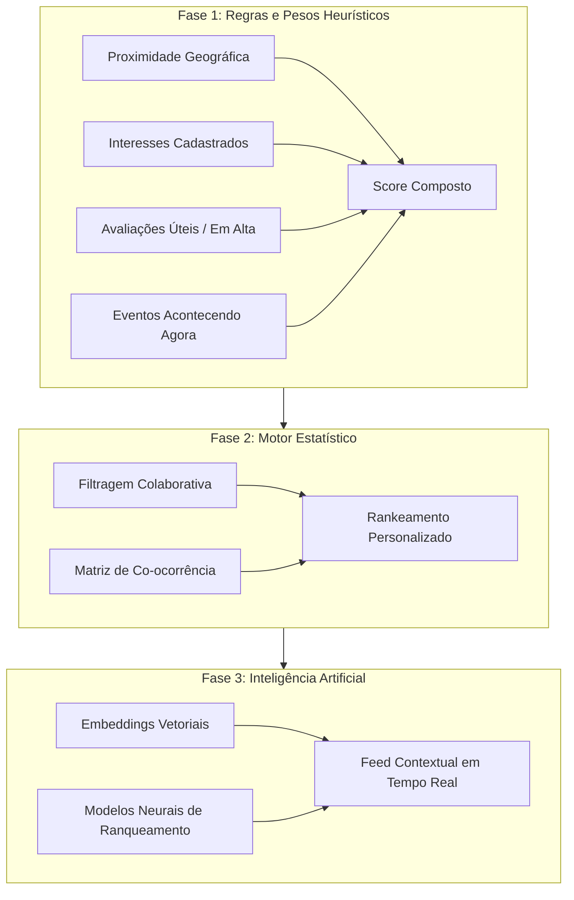

# REWIT - VISÃO DO PRODUTO (PRODUCT_VISION.md)

---

## 1. O que é o Rewit?

O **Rewit** é uma rede social geográfica de avaliações sobre o mundo físico (lugares, produtos e serviços). 

Diferente de catálogos estáticos ou sistemas tradicionais de busca por estrelas (como Google Maps, Yelp ou TripAdvisor), o Rewit é centrado na **experiência social ativa**, na **dinâmica de comunidade** e na **verificação física de presença**.

O objetivo primordial do produto não é ser apenas um repositório de pontuações de 1 a 5 estrelas, mas sim uma plataforma vibrante onde os usuários:
- Descobrem o que pessoas reais estão experienciando ao seu redor em tempo real;
- Fotografam, catalogam e avaliam produtos consumidos em estabelecimentos físicos;
- Validam suas opiniões com o selo de presença física (**Check-in Verificado**);
- Debatem pontos de vista em discussões construtivas nas publicações;
- Identificam produtos instantaneamente via scanner óptico (código de barras, QR Code, OCR e reconhecimento visual);
- Constroem uma reputação sólida como avaliadores especializados e confiáveis na sua região;
- Consomem um feed contextual e dinâmico, adaptado à sua localização, interesses e momentos temporais (eventos e novidades).

---

## 2. O Conceito Central da Avaliação Multi-Alvo

No mundo real, a experiência de consumo é multifacetada. Quando um usuário frequenta um estabelecimento, ele quase nunca consome apenas o "local": ele consome o **espaço**, interage com o **atendimento** e experimenta **produtos específicos**.

### Exemplo Prático de Publicação Única:
Um usuário visita uma cafeteria ou restaurante (ex: *McDonald's Shopping X*):
1. **Target 1: PLACE (Local)**
   - Alvo: *McDonald's Shopping X*
   - Nota: `4.0 / 5.0` (ambiente limpo, fácil de estacionar, porém barulhento).
2. **Target 2: SERVICE (Serviço)**
   - Alvo: *Atendimento no Caixa / Balcão*
   - Nota: `2.0 / 5.0` (fila demorada, atendente desatento).
3. **Target 3: PRODUCT (Produto)**
   - Alvo: *Big Mac Combo*
   - Nota: `5.0 / 5.0` (lanche quente, batata crocante, no padrão ideal).
4. **Target 4: PRODUCT (Produto Adicional)**
   - Alvo: *Sundae de Chocolate*
   - Nota: `3.5 / 5.0` (calda fria em excesso).
5. **EXPERIENCE (Dimensão Qualitativa da Publicação)**
   - Texto livre narrativo contextualizando o almoço de domingo, tempo de espera e impressões gerais.

### Regras Mandatórias de Pontuação e Métricas:
- Cada alvo avaliado (`ReviewTarget`) alimenta **sua própria média e seu próprio contador de avaliações**.
- A nota atribuída ao hambúrguer alimenta a média global daquele produto em escala nacional/local.
- A nota atribuída ao serviço impacta a reputação de serviço da filial específica.
- A nota do local compõe a nota geral de infraestrutura e ambiente daquele estabelecimento.
- **Proibição de Duplicação Indevida**: A nota geral da publicação não pode inflacionar artificialmente as médias individuais. Cada alvo possui cálculo isolado e idempotente.

---

## 3. "Experiência" como Dimensão, Não como Entidade Isolada

No Rewit, a **Experiência** não é modelada como uma tabela ou entidade de banco separada. Ela é a **dimensão qualitativa e textual** da própria avaliação (`Review`).

### Categorização e Extração Semântica:
Uma avaliação pode cobrir múltiplos vetores de experiência. Futuramente, o backend e os serviços de inteligência inferirão e classificarão automaticamente tags de contexto a partir do texto livre:
- **Atendimento**: cordialidade, presteza, conhecimento da equipe;
- **Tempo de Espera**: fila, preparo, agilidade;
- **Qualidade**: acabamento, frescor dos insumos, confiabilidade;
- **Preço e Custo-Benefício**: percepção de valor monetário;
- **Ambiente**: iluminação, acústica, música, conforto, climatização;
- **Limpeza e Higiene**: sanitários, salão, mesas, apresentação;
- **Entrega / Logística**: acondicionamento, pontualidade (em serviços de delivery).

Essas tags enriquecerão o motor de busca sem sobrecarregar o usuário com formulários burocráticos durante a escrita da avaliação.

---

## 4. Localização, Presença Física e Check-in

O Rewit prioriza a liberdade de uso sem abdicar da credibilidade das avaliações:

### Modos de Operação do Usuário:
1. **Sem Concessão de Localização Precisa**:
   - O usuário pode navegar, pesquisar lugares, ler avaliações, salvar conteúdos e publicar avaliações retroativas.
   - **Restrição**: As avaliações publicadas sem coordenadas válidas no momento da postagem **não recebem** o selo de *"Avaliado no Local"* e não computam check-in.
2. **Com Localização Precisa Autorizada**:
   - Ao redigir uma avaliação de um `Place`, o aplicativo obtém as coordenadas geográficas pontuais do dispositivo.
   - O sistema valida no backend (PostGIS) se a distância entre o usuário e o centróide/polígono do local é inferior ao raio de tolerância configurado (`validation_radius_meters`).
   - Se validada a presença física, a avaliação é marcada com `is_verified_on_site = true` e um registro de `CheckIn` é vinculado automaticamente.

### Regras de Negócio Inegociáveis de Check-in:
- **Não existe check-in sem avaliação**: O check-in não é um botão isolado para "fazer presença". Ele é um comprovante de que a opinião emitida é de quem realmente esteve lá.
- **Avaliação Mínima**: Se o usuário não desejar redigir um texto longo no calor do momento, ele pode submeter apenas a nota de estrelas para registrar o check-in e validar sua presença física.
- **Raio Configurável**: O raio de aceitação física não é hardcoded no código; é um parâmetro ajustável por tipo de local (ex: um quiosque de 50m² tem raio diferente de um shopping center de 200.000m²).

---

## 5. Feed Dinâmico e Motor de Recomendação

O feed do Rewit não é uma linha do tempo cronológica trivial. Ele é um agregador social dinâmico estruturado em três fases de evolução arquitetural:



### Prioridades Editoriais do Feed:
1. Avaliações altamente úteis e com selo de verificação no local;
2. Conteúdos criados por usuários seguidos;
3. Lugares e produtos relevantes num raio geográfico acessível;
4. Eventos temporais acontecendo no dia ou no fim de semana próximo;
5. Novidades e tendências baseadas no histórico de interesses do usuário;
6. Promoções legítimas publicadas por estabelecimentos reivindicados.

---

## 6. Eventos Temporais e Vida Urbana

Os eventos são fundamentais para manter o feed orgânico e vivo:
- Um estabelecimento (`Place`) pode sediar múltiplos eventos temporais (`Event`), como shows, exposições artísticas, festivais gastronômicos ou promoções temáticas.
- Exemplos: *Exposição Van Gogh* no *Shopping Plaza* ou *Festival de Cafés Especiais* na cafeteria central.
- Cada evento possui janela temporal estrita (`start_time`, `end_time`), localização geográfica, categoria e status, recebendo prioridade no feed de pessoas próximas durante sua vigência.

---

## 7. Reputação da Comunidade vs. Sistema Cosmético de Recompensas

Para manter a integridade editorial e prevenir fraudes, o Rewit separa estritamente **Reputação** de **Cosméticos**:

### Sistema de Reputação (Confiança e Mérito):
- Pontuado com base em:
  - Avaliações marcadas como *Úteis* pela comunidade;
  - Avaliações verificadas com check-in presencial;
  - Volume e consistência de contribuições com fotos de alta qualidade;
  - Especializações de nicho (ex: *"Top 10 Avaliadores de Cafés em Curitiba"*).
- **Avaliações Anônimas**: Usuários podem postar anonimamente para proteger sua privacidade em críticas sensíveis. Tais avaliações permanecem públicas, mas recebem peso reduzido/nulo em rankings e não geram pontos de reputação. O usuário real é registrado criptograficamente no backend para moderação interna contra difamação ou ataques coordenados.
- **Rankings de Check-in**: Painéis de líderes filtrados por período (semana, mês, ano), localização (bairro, cidade, estado, país) e segmento (gastronomia, lazer, serviços, parques).

### Sistema de Recompensas Cosméticas:
- Pontos obtidos por engajamento comunitário podem ser trocados exclusivamente por personalizações visuais:
  - Emotes e reações exclusivas em comentários;
  - Molduras para avatar;
  - Badges decorativos de perfil;
  - Temas visuais.
- **Isolamento Mandatório**: Nenhum item cosmético pode comprar reputação ou alterar a nota de um local.

---

## 8. Scanner e Reconhecimento Óptico de Produtos

O scanner é a ponte primária entre o mundo físico e o ecossistema digital do Rewit. Sua arquitetura é planejada para evoluir progressivamente:

```
[ Câmera do App ]
       │
       ├──► 1. Código de Barras (EAN-13, UPC-A, GTIN)  ──► Busca Catálogo Local / Provedores
       │
       ├──► 2. QR Code (URLs do Rewit, Cardápios, Mesas) ──► Roteamento Instantâneo
       │
       ├──► 3. OCR (Texto de Rótulos e Embalagens)       ──► Busca por Nome e Marca
       │
       └──► 4. Reconhecimento Visual (Serviço Vision)   ──► Classificação por Imagem / Embeddings
                                                                 │
                                                                 ▼
                                                    [ Confirmação do Usuário ]
```

- **Códigos Suportados**: EAN, UPC, QR Code e códigos de padrão de varejo internacional.
- **Confirmação Humana**: O scanner sugere o produto detectado, permitindo que o usuário valide ou selecione a variação correta antes de publicar a avaliação.

---

## 9. Contas Comerciais (Business) e Gestão por Proprietários

Os donos de estabelecimentos e prestadores de serviço possuem espaço dedicado no Rewit:
- **Reivindicação de Locais**: Verificação de identidade de proprietários e gerentes comerciais.
- **Direito de Resposta**: Estabelecimentos podem responder publicamente a elogios e críticas com selo oficial de resposta da empresa.
- **Divulgações e Promoções**: Criação de campanhas contextuais e eventos temporais vinculados ao local.
- **Proibição de Censura por Proprietários**: É categoricamente **proibido** que o dono de um local remova ou oculte avaliações negativas legítimas. Se uma avaliação violar os termos de uso (discurso de ódio, conteúdo falso, difamação), o proprietário pode acionar o fluxo de denúncia e moderação.

---

## 10. Crescimento Gradual e Independência de Dados

O Rewit adota o modelo de **Bootstrap e Crescimento Orgânico**:
1. **Fase Inicial**: O sistema utiliza o Google Places para busca assistida quando o catálogo local do Rewit ainda não possuir estabelecimentos cadastrados em determinada coordenada.
2. **Conversão**: Assim que o primeiro usuário do Rewit avalia ou faz check-in em um local descoberto via Places, aquele local é materializado na base de dados do Rewit (com nosso próprio ID interno e referência ao `google_place_id`).
3. **Maturidade**: Conforme os usuários cadastram produtos locais, serviços específicos e novas avaliações, o Rewit torna-se autossuficiente e independente de provedores externos.
