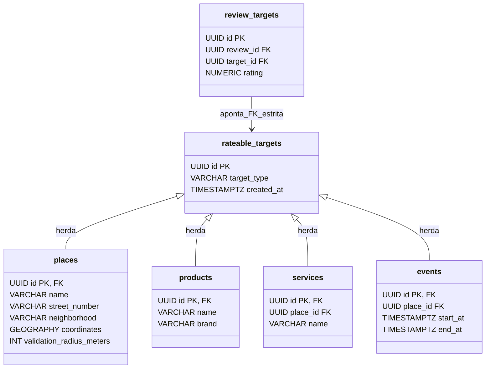

# ESQUEMA DE BANCO DE DADOS E POSTGIS (docs/database/schema-overview.md)

Este documento descreve a modelagem física relacional, a extensão espacial PostGIS e a estratégia de migrações determinísticas gerenciadas pelo **Flyway** na plataforma **Rewit**.

---

## 1. Tecnologias e Configurações Essenciais

- **SGBD**: PostgreSQL 18.x
- **Extensão Geoespacial**: PostGIS 3.6.x
- **Imagem Oficial Homologada**: `postgis/postgis:18-3.6`
- **Volume de Dados**: `postgres_data:/var/lib/postgresql` (padrão oficial PostgreSQL 18)
- **Sistema de Coordenadas (SRID)**: `4326` (WGS 84 - Elipsoide geodésico universal)
- **Tipo de Dado Espacial Padrão**: `GEOGRAPHY(Point, 4326)`
- **Estratégia de Versionamento**: **Flyway 11.x** (todas as alterações de banco são arquivos `.sql` imutáveis versionados em `backend/src/main/resources/db/migration`)
- **Validação no Hibernate**: `spring.jpa.hibernate.ddl-auto: validate` na aplicação (proibido `update` ou `create`). O perfil de testes não aplica essa validação a todos os contextos; o contrato entre entidades JPA e o schema Flyway é verificado por `JpaSchemaValidationIntegrationTest`, que sobe o contexto com `validate` e o mesmo dialeto PostGIS da aplicação. Colunas `NUMERIC` são mapeadas como `BigDecimal` com `precision`/`scale` correspondentes.
- **Migrations não transacionais**: uma migration com `CREATE INDEX CONCURRENTLY` (como a V16) precisa de um `.sql.conf` com `executeInTransaction=false` e de `spring.flyway.postgresql.transactional-lock=false`. Com o lock transacional padrão, o Flyway segura `pg_try_advisory_xact_lock` em uma transação aberta numa conexão separada, e o `CONCURRENTLY` espera essa transação terminar, o que nunca acontece. Com `false`, o Flyway usa o advisory lock de sessão (`pg_try_advisory_lock`/`pg_advisory_unlock`); as demais migrations continuam rodando cada uma em sua própria transação. A propriedade está em `application-local.yml` (único perfil da aplicação) e no `application.yml` de testes; um novo perfil precisa repeti-la, e o lock de sessão exige que o Flyway não passe por pooler em modo transação.

---

## 2. Invariante de Integridade Polimórfica (ADR-009)

Para viabilizar que uma única publicação (`Review`) avalie alvos de tipos completamente distintos (`Place`, `Product`, `PlaceService`, `PlaceEvent`) sem fragilidade relacional ou órfãos, adotamos o padrão **Rateable Target Root**:



- A tabela `review_targets` aponta diretamente para `rateable_targets(id)` com chave estrangeira estrita e constraint `UNIQUE (review_id, target_id)`.
- A integridade relacional é 100% garantida no próprio motor do PostgreSQL.

---

## 3. Gestão Desacoplada de Médias e Estatísticas (`rateable_target_stats`)

Conforme a **Regra 35 do Projeto**, é proibido armazenar notas médias móveis como colunas mutáveis avulsas dentro das tabelas de cadastro (`places.average_rating`, `products.average_rating`).

A tabela `rateable_target_stats`:
```sql
CREATE TABLE rateable_target_stats (
    target_id UUID PRIMARY KEY REFERENCES rateable_targets(id) ON DELETE CASCADE,
    average_rating NUMERIC(3, 2) NOT NULL DEFAULT 0.00 CHECK (average_rating >= 0.00 AND average_rating <= 5.00),
    reviews_count INT NOT NULL DEFAULT 0 CHECK (reviews_count >= 0),
    last_calculated_at TIMESTAMP WITH TIME ZONE NOT NULL DEFAULT NOW()
);
```
Isso isola transações de alta frequência de escrita das consultas de leitura do catálogo.

---

## 4. Histórico de Migrações Flyway

### `V1__initial_schema.sql` (Fundação Inicial)
- Ativa extensões `postgis`, `uuid-ossp`, `pg_trgm`, `pgcrypto`.
- Cria as primeiras 22 tabelas do ecossistema, constraints primárias e índices GiST.

### `V2__domain_consolidation.sql` (Consolidação do Domínio - Prompt 02)
- `users`: Adição de `deleted_at TIMESTAMPTZ` para prontidão de soft-deletion.
- `places`: Adição de `street_number VARCHAR(32)` e `neighborhood VARCHAR(128)`.
- `places`: Índice composto `idx_places_city_neighborhood` para buscas de bairro.
- `check_ins`: Adição de `verification_method VARCHAR(32) DEFAULT 'GPS'` com constraint `chk_checkin_verification_method` (`GPS`, `QR_CODE`, `NFC`, `BEACON`).
- `user_interests`: Adição de `weight NUMERIC(3, 2) DEFAULT 1.00` com constraint `chk_user_interest_weight` (entre 0.00 e 1.00).
- `notifications`: Adição de `metadata_json JSONB`.
- `rateable_target_stats`: Índice `idx_rateable_target_stats_rating` em `average_rating DESC`.

### `V3__domain_integrity_refinement.sql` (Refinamento de Integridade e Consistência - Step 2.1)
- `check_ins`: Alteração de status default para `'PENDING'`; remoção de NOT NULL e remoção de default em `verified_at`.
- `check_ins`: Adição de `chk_checkin_status` (`PENDING`, `VERIFIED`, `REJECTED`) e `chk_checkin_verified_at_consistency` (exige `verified_at IS NOT NULL` se VERIFIED e `IS NULL` se PENDING/REJECTED).
- `reviews`: Constraint única composta `uq_reviews_id_user_context_place (id, user_id, context_place_id)`.
- `check_ins`: Foreign Key composta `fk_check_ins_review_user_place (review_id, user_id, place_id) REFERENCES reviews (id, user_id, context_place_id) ON DELETE CASCADE`.
- `check_ins`: Trigger `trg_check_in_review_consistency` garantindo que `context_place_id` da review seja preenchido e que `user_id` e `place_id` sejam estritamente idênticos aos da review.
- `check_ins` / `reviews`: Trigger `trg_sync_check_in_to_review_verified` sincronizando `reviews.is_verified_on_site` com base em `CheckIn.status == 'VERIFIED'` (única fonte de verdade).
- `reviews`: Trigger `trg_prevent_unverified_review_flag` bloqueando alteração manual de `is_verified_on_site = TRUE` sem um CheckIn VERIFIED correspondente.
- `rateable_targets`: Constraint `chk_rateable_target_type` (`PLACE`, `PRODUCT`, `SERVICE`, `EVENT`).
- Especializações (`places`, `products`, `services`, `events`): Triggers `trg_validate_*_specialization` impedindo associação com alvos de tipo incorreto.

### `V4__identity_integrity.sql` (Integridade de Identidade e Autenticação - Step 3)
- `users`: Substituição da constraint `uq_users_email` por índice único case-insensitive `uq_users_email_lower ON users (LOWER(email))`. O e-mail permanece reservado incondicionalmente mesmo após soft-delete (`deleted_at IS NOT NULL`) para prevenir sequestro de contas e impersonação no MVP.
- `users`: Substituição do índice não-único `idx_users_provider` pelo índice único parcial `uq_users_provider_user_id ON users (auth_provider, provider_user_id) WHERE provider_user_id IS NOT NULL`. Permite múltiplos usuários `LOCAL` com `provider_user_id = NULL` sem colisão e assegura unicidade para identidades remotas (`GOOGLE`, `APPLE`).
- `profiles`: Substituição da constraint `uq_profiles_handle` por índice único case-insensitive `uq_profiles_handle_lower ON profiles (LOWER(handle))`. Preserva o índice trigram GIN `idx_profiles_handle_trgm` para buscas textuais parciais.
- `rateable_targets`: Trigger `trg_prevent_rateable_target_type_change` impedindo alteração de `target_type` de alvos já especializados.
- CHECK constraints adicionadas: `chk_review_status`, `chk_review_visibility`, `chk_review_location_accuracy`, `chk_places_status`, `chk_products_status`, `chk_services_status`, `chk_events_status`, `chk_users_auth_provider`, `chk_business_verification_status`, `chk_business_plan_tier`, `chk_review_tags_source`.

---

## 5. Constraints do Banco de Dados

| Tabela | Nome da Constraint | Tipo | Regra / Expressão |
| :--- | :--- | :--- | :--- |
| `rateable_targets` | `chk_rateable_target_type` | CHECK | `target_type IN ('PLACE', 'PRODUCT', 'SERVICE', 'EVENT')` |
| `review_targets` | `chk_rating_range` | CHECK | `rating >= 1.0 AND rating <= 5.0` |
| `review_targets` | `uq_review_target` | UNIQUE | `(review_id, target_id)` |
| `reviews` | `uq_reviews_id_user_context_place` | UNIQUE | `(id, user_id, context_place_id)` |
| `reviews` | `chk_review_status` | CHECK | `status IN ('ACTIVE', 'UNDER_REVIEW', 'REMOVED')` |
| `reviews` | `chk_review_visibility` | CHECK | `visibility IN ('PUBLIC', 'PRIVATE', 'FOLLOWERS')` |
| `reviews` | `chk_review_location_accuracy` | CHECK | `location_accuracy_meters IS NULL OR location_accuracy_meters >= 0` |
| `check_ins` | `uq_checkin_review` | UNIQUE | `(review_id)` (1 check-in por review) |
| `check_ins` | `fk_check_ins_review_user_place` | FK | `(review_id, user_id, place_id) REFERENCES reviews` |
| `check_ins` | `chk_checkin_status` | CHECK | `status IN ('PENDING', 'VERIFIED', 'REJECTED')` |
| `check_ins` | `chk_checkin_verification_method` | CHECK | `verification_method IN ('GPS', 'QR_CODE', 'NFC', 'BEACON')` |
| `check_ins` | `chk_checkin_verified_at_consistency` | CHECK | `(status = 'VERIFIED' AND verified_at IS NOT NULL) OR (status IN ('PENDING', 'REJECTED') AND verified_at IS NULL)` |
| `places` | `chk_places_radius` | CHECK | `validation_radius_meters > 0` |
| `places` | `chk_places_status` | CHECK | `status IN ('ACTIVE', 'INACTIVE', 'CLOSED')` |
| `places` | `uq_places_slug` | UNIQUE | `(slug)` |
| `products` | `chk_products_status` | CHECK | `status IN ('ACTIVE', 'INACTIVE', 'DISCONTINUED')` |
| `services` | `chk_services_status` | CHECK | `status IN ('ACTIVE', 'INACTIVE')` |
| `events` | `chk_events_status` | CHECK | `status IN ('SCHEDULED', 'HAPPENING_NOW', 'FINISHED', 'CANCELLED')` |
| `events` | `chk_event_dates` | CHECK | `end_at >= start_at` |
| `users` | `chk_users_auth_provider` | CHECK | `auth_provider IN ('LOCAL', 'GOOGLE', 'APPLE')` |
| `users` | `chk_users_active_not_deleted` | CHECK | `NOT (is_active AND deleted_at IS NOT NULL)` (V17; a migration antes normaliza para `is_active = FALSE` as linhas já excluídas) |
| `business_accounts` | `chk_business_verification_status` | CHECK | `verification_status IN ('PENDING', 'APPROVED', 'REJECTED')` |
| `business_accounts` | `chk_business_plan_tier` | CHECK | `plan_tier IN ('FREE', 'PREMIUM')` |
| `review_tags` | `chk_review_tags_source` | CHECK | `source IN ('USER', 'RULE', 'AI', 'MODERATOR')` |
| `promotions` | `chk_promotion_dates` | CHECK | `end_at >= start_at` |
| `discussion_reports` | `uq_discussion_report_reporter` | UNIQUE | `(discussion_id, reporter_user_id)` (V19) |
| `discussion_reports` | `chk_discussion_reports_status` | CHECK | `status IN ('PENDING', 'ACCEPTED', 'REJECTED')`; índice parcial `idx_discussion_reports_pending_queue (created_at, id) WHERE status = 'PENDING'` |
| `discussion_moderation_audit_logs` | `chk_discussion_moderation_audit_action` | CHECK | `action IN ('REMOVE_DISCUSSION', 'RESTORE_DISCUSSION')` (V20); append-only por trigger `trg_prevent_discussion_moderation_audit_update` (rejeita `UPDATE`) |
| `user_follows` | `chk_no_self_follow` | CHECK | `follower_user_id <> followed_user_id` |
| `user_follows` | `uq_user_follow` | UNIQUE | `(follower_user_id, followed_user_id)` |
| `product_identifiers` | `uq_product_identifier` | UNIQUE | `(identifier_type, identifier_value)` |
| `product_presences` | `uq_product_place` | UNIQUE | `(product_id, place_id)` |
| `place_external_references` | `uq_place_ext_ref` | UNIQUE | `(provider, external_id)` |
| `user_interests` | `uq_user_interest` | UNIQUE | `(user_id, category_code)` |
| `user_interests` | `chk_user_interest_weight` | CHECK | `weight >= 0.00 AND weight <= 1.00` |
| `review_tags` | `uq_review_tag` | UNIQUE | `(review_id, tag_id)` |
| `saved_items` | `uq_user_saved_target` | UNIQUE | `(user_id, target_id, item_type)` |
| `auth_sessions` | `uq_auth_sessions_token_hash` | UNIQUE | `(token_hash)` |

---

## 6. Triggers de Integridade Relacional

1. **`trg_check_in_review_consistency`** (em `check_ins`):
   Garante antes de INSERT ou UPDATE que a Review existe, possui `context_place_id` preenchido e que `user_id` e `place_id` do check-in coincidem exatamente com o autor e local da review.
2. **`trg_sync_check_in_to_review_verified`** (em `check_ins`):
   Sincroniza `reviews.is_verified_on_site = (NEW.status = 'VERIFIED')` em tempo real após INSERT, UPDATE ou DELETE no check-in (garantindo que o CheckIn seja a única fonte da verdade).
3. **`trg_prevent_unverified_review_flag`** (em `reviews`):
   Impede que `is_verified_on_site` seja alterada para TRUE sem que exista um CheckIn validado (`status = 'VERIFIED'`).
4. **`trg_validate_*_specialization`** (em `places`, `products`, `services`, `events`):
   Impede que um `RateableTarget` de um tipo seja inserido na tabela de outro tipo.
5. **`trg_prevent_rateable_target_type_change`** (em `rateable_targets`):
   Impede que a coluna `target_type` seja modificada caso o alvo já possua especialização cadastrada.

---

## 7. Índices Justificados

### Índices Espaciais GiST (Generalized Search Tree)
- `idx_places_coordinates` em `places(coordinates)`: Acelera consultas de raio geodésico (`ST_DWithin`).
- `idx_reviews_coordinates` em `reviews(user_coordinates)`: Acelera filtros geográficos em avaliações.
- `idx_checkins_coordinates` em `check_ins(coordinates)`: Acelera auditorias de telemetria presencial.

### Índices Trigram (GIN)
- `idx_places_name_trgm` em `places USING GIN (name gin_trgm_ops)`: Acelera busca textual aproximada com tolerância a erros de digitação.
- `idx_products_name_trgm` em `products USING GIN (name gin_trgm_ops)`: Acelera busca difusa por nome/marca de produto.
- `idx_profiles_handle_trgm` em `profiles USING GIN (handle gin_trgm_ops)`: Acelera autocompletar de menções sociais (`@handle`).

### Índices Chaves Estrangeiras e Filtros Compostos
- `idx_places_city_neighborhood`: Acelera navegação geográfica em feed local.
- `idx_review_targets_review` e `idx_review_targets_target`: Evita sequential scans em joins de reviews e alvos.
- `idx_rateable_target_stats_rating`: Acelera ordenação e descoberta dos melhores avaliados.
- `idx_auth_sessions_user_id`: Acelera busca e invalidação em lote de sessões por usuário.
- `idx_auth_sessions_expires_at`: Acelera rotinas de limpeza de refresh tokens expirados.
- `idx_auth_sessions_revoked_at`: Acelera filtragem de sessões válidas vs revogadas.
- `idx_auth_sessions_replaced_by_session_id` (V16, parcial `WHERE replaced_by_session_id IS NOT NULL`): atende a busca do `ON DELETE SET NULL` a cada sessão removida pelo cleanup (Step 29.3, ADR-011).

---

## 8. Tabela de Sessões de Autenticação (`auth_sessions` - V5)

Armazena as sessões e hashes de Refresh Tokens (Step 4):

| Coluna | Tipo | Modificador | Descrição |
|---|---|---|---|
| `id` | `UUID` | `PRIMARY KEY DEFAULT gen_random_uuid()` | Identificador único da sessão |
| `user_id` | `UUID` | `NOT NULL REFERENCES users(id) ON DELETE CASCADE` | Usuário proprietário |
| `token_hash` | `VARCHAR(64)` | `NOT NULL UNIQUE` | Hash SHA-256 hexadecimal do Refresh Token |
| `issued_at` | `TIMESTAMPTZ` | `NOT NULL DEFAULT CURRENT_TIMESTAMP` | Data/hora de emissão |
| `expires_at` | `TIMESTAMPTZ` | `NOT NULL` | Expiração da sessão |
| `revoked_at` | `TIMESTAMPTZ` | `NULL` | Data de revogação/logout |
| `replaced_by_session_id` | `UUID` | `NULL REFERENCES auth_sessions(id) ON DELETE SET NULL` | Sessão sucessora após rotação |
| `created_at` | `TIMESTAMPTZ` | `NOT NULL DEFAULT CURRENT_TIMESTAMP` | Criação do registro |
| `last_used_at` | `TIMESTAMPTZ` | `NULL` | Último uso da sessão |
| `user_agent` | `TEXT` | `NULL` | Cabeçalho User-Agent para telemetria |
| `ip_address` | `INET` | `NULL` | Endereço IP do cliente no momento da emissão |
