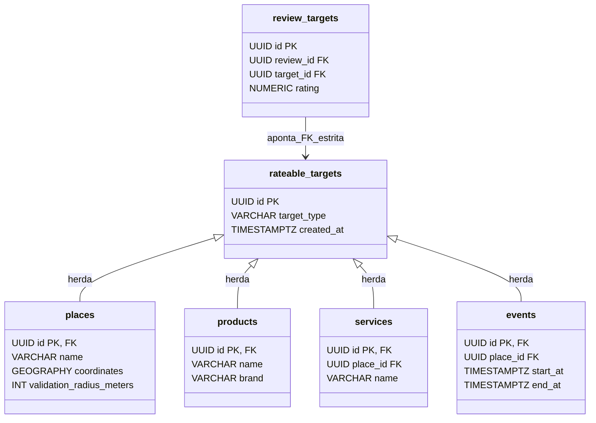

# ESQUEMA DE BANCO DE DADOS E POSTGIS (docs/database/schema-overview.md)

Este documento descreve a modelagem física relacional, a extensão espacial PostGIS e a estratégia de migrações determinísticas gerenciadas pelo **Flyway** na plataforma **Rewit**.

---

## 1. Tecnologias e Configurações Essenciais

- **SGBD**: PostgreSQL 18
- **Extensão Geoespacial**: PostGIS 3.6
- **Imagem Oficial Homologada**: `postgis/postgis:18-3.6`
- **Volume de Dados**: `postgres_data:/var/lib/postgresql` (padrão oficial PostgreSQL 18)
- **Sistema de Coordenadas (SRID)**: `4326` (WGS 84 - Elipsoide geodésico universal)
- **Tipo de Dado Espacial Padrão**: `GEOGRAPHY(Point, 4326)`
- **Estratégia de Versionamento**: **Flyway 11.x** (todas as alterações de banco são arquivos `.sql` imutáveis versionados em `classpath:db/migration`)
- **Validação no Hibernate**: `spring.jpa.hibernate.ddl-auto: validate` (proibido `update` ou `create`)

---

## 2. Invariante de Integridade Polimórfica (ADR-009)

Para viabilizar que uma única publicação (`Review`) avalie alvos de tipos completamente distintos (`Place`, `Product`, `Service`, `Event`) sem fragilidade relacional ou órfãos, adotamos o padrão **Rateable Target Root**:



- A tabela `review_targets` aponta diretamente para `rateable_targets(id)` com chave estrangeira estrita e constraint `UNIQUE (review_id, target_id)`.
- A integridade relacional é 100% garantida no próprio motor do PostgreSQL.

---

## 3. Gestão Desacoplada de Médias e Estatísticas (`rateable_target_stats`)

Conforme a **Regra 37 do Projeto**, é proibido armazenar notas médias móveis como colunas mutáveis avulsas dentro das tabelas de cadastro (`places.average_rating`, `products.average_rating`).

A tabela `rateable_target_stats`:
```sql
CREATE TABLE rateable_target_stats (
    target_id UUID PRIMARY KEY REFERENCES rateable_targets(id) ON DELETE CASCADE,
    average_rating NUMERIC(3, 2) NOT NULL DEFAULT 0.00 CHECK (average_rating >= 0.00 AND average_rating <= 5.00),
    reviews_count INT NOT NULL DEFAULT 0 CHECK (reviews_count >= 0),
    last_calculated_at TIMESTAMP WITH TIME ZONE NOT NULL DEFAULT NOW()
);
```
Isso isola transações de alta frequência de escrita das consultas de leitura do catálogo.

---

## 4. Índices Espaciais e Consultas PostGIS

### Índices Espaciais GiST (Generalized Search Tree)
Criados compulsoriamente em todas as colunas do tipo `geography`:
```sql
CREATE INDEX idx_places_coordinates ON places USING GIST (coordinates);
CREATE INDEX idx_reviews_coordinates ON reviews USING GIST (user_coordinates);
CREATE INDEX idx_checkins_coordinates ON check_ins USING GIST (coordinates);
```

### Consulta Canônica de Proximidade (Raio em Metros)
```sql
SELECT 
    p.id,
    p.name,
    p.address_text,
    s.average_rating,
    s.reviews_count,
    ROUND(ST_Distance(p.coordinates, ST_SetSRID(ST_MakePoint(:userLng, :userLat), 4326)::geography)::numeric, 1) AS distance_meters
FROM places p
LEFT JOIN rateable_target_stats s ON s.target_id = p.id
WHERE ST_DWithin(p.coordinates, ST_SetSRID(ST_MakePoint(:userLng, :userLat), 4326)::geography, :radiusMeters)
ORDER BY distance_meters ASC
LIMIT 30;
```

### Consulta de Validação de Check-in Presencial
```sql
SELECT 
    p.id,
    p.name,
    p.validation_radius_meters,
    ST_Distance(p.coordinates, ST_SetSRID(ST_MakePoint(:userLng, :userLat), 4326)::geography) AS current_distance_meters,
    (ST_Distance(p.coordinates, ST_SetSRID(ST_MakePoint(:userLng, :userLat), 4326)::geography) <= p.validation_radius_meters) AS is_within_bounds
FROM places p
WHERE p.id = :placeId;
```
