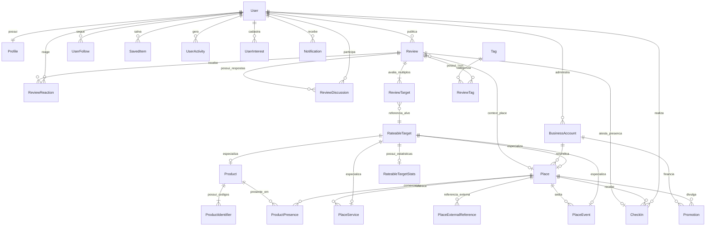

# MODELAGEM CONSOLIDADA DE DOMÍNIO (docs/domain/entities.md)

Este documento especifica a modelagem conceitual e relacional completa das 25 entidades de domínio do **Rewit**, incorporando o padrão de integridade **RateableTarget Root (ADR-009)**, portas de referência externa, desacoplamento de estatísticas derivadas, taxonomia semântica, validação de check-in presencial e plano de expansão geoespacial.

---

## 1. Diagrama de Relacionamento de Entidades (ERD Consolidado)

---

## 2. Especificação Detalhada das 25 Entidades de Domínio

### 1. `RateableTarget` (Raiz Polimórfica Relacional - ADR-009)
- **Papel**: Identidade canônica central e raiz física relacional no banco de dados para qualquer entidade que possa receber avaliações.
- **Campos**: `id` (UUIDv4 PK), `target_type` (`PLACE`, `PRODUCT`, `SERVICE`, `EVENT`), `created_at`.
- **Invariantes e Coerência**:
  - Garante chave estrangeira física e integridade referencial estrita em `review_targets`. Impede apontamento de reviews para IDs fantasmas ou deletados.
  - **Coerência estrita de especialização**: Um registro de `target_type = PLACE` só pode ser associado à tabela `places`; `PRODUCT` exclusivamente a `products`; `SERVICE` a `services`; e `EVENT` a `events`. Essa integridade é assegurada por triggers no banco de dados e pela hierarquia orientada a objetos no domínio.
  - É proibido alterar o `target_type` de um `RateableTarget` caso já existam registros vinculados na respectiva tabela especializada.

### 2. `RateableTargetStats` (Métricas e Agregados Derivados - Seção 7 e 35)
- **Papel**: Armazena as estatísticas agregadas de avaliações de forma estritamente desacoplada das tabelas de cadastro.
- **Campos**: `target_id` (UUID PK / FK para `rateable_targets.id`), `average_rating` (`NUMERIC(3, 2)`, 0.00 a 5.00), `reviews_count` (`INT`, >= 0), `last_calculated_at` (`TIMESTAMPTZ`).
- **Regra**: Médias de notas **nunca** são mantidas como colunas mutáveis soltas em `Place` ou `Product`. A atualização é derivada e assíncrona.

### 3. `User` (Identidade e Autenticação Interna - Seção 4)
- **Papel**: Conta de usuário interna da plataforma.
- **Campos**: `id` (UUIDv4 interno), `email` (único, normalizado em minúsculas), `password_hash` (nulo em autenticações federadas), `auth_provider` (`LOCAL`, `GOOGLE`, `APPLE`), `provider_user_id` (identificador externo do provedor), `is_active` (`BOOLEAN`), `is_verified` (`BOOLEAN`), `deleted_at` (`TIMESTAMPTZ`, soft deletion), `created_at`, `updated_at`.
- **Regra**: O Google ID (sub) nunca é utilizado como primary key. Preparado para múltiplos provedores sem acoplamento.

### 4. `Profile` (Perfil Público e Social - Seção 5)
- **Papel**: Apresentação pública do usuário na rede social.
- **Campos**: `id` (UUIDv4), `user_id` (UUID FK única para `users.id`), `handle` (ex: `@joaosilva`, único, minúsculo, indexado por Trigram GIN), `display_name`, `bio`, `avatar_url`, `reputation_score` (`INT >= 0`), `is_anonymous_default` (`BOOLEAN`), `created_at`, `updated_at`.
- **Regra de Reputação**: O `reputation_score` é uma pontuação calculada derivada da atividade comunitária legítima (reviews verificadas, reações úteis recebidas), e não um valor arbitrário.

### 5. `Place` (Local Físico / Ponto Geográfico - Seção 8)
- **Papel**: Ponto geográfico real (restaurante, parque, loja, praça, hotel, aeroporto, etc.). Herda `RateableTarget`.
- **Campos**: `id` (UUID PK / FK `rateable_targets.id`), `name`, `slug` (único), `category`, `description`, `address_text`, `street_number` (`VARCHAR(32)`), `neighborhood` (`VARCHAR(128)`), `city`, `state`, `country` (default `'BR'`), `coordinates` (`GEOGRAPHY(Point, 4326)` com índice GiST), `validation_radius_meters` (`INT > 0`, configurável por local, default 50m), `origin` (`USER`, `GOOGLE`, `IMPORT`), `is_verified`, `claimed_by_business_id` (FK `business_accounts.id`), `status` (`ACTIVE`, `INACTIVE`, `CLOSED`), `created_at`, `updated_at`.
- **Regra**: `Place` representa espaço físico no mundo real e não significa necessariamente pessoa jurídica.

### 6. `PlaceExternalReference` (Referências de Provedores Externos - Seção 10)
- **Papel**: Armazena identificadores de provedores de dados externos (ex: Google Places `place_id`, OpenStreetMap `osm_id`) sem acoplar o modelo principal nem duplicar bancos inteiros.
- **Campos**: `id` (UUIDv4), `place_id` (UUID FK `places.id`), `provider` (`GOOGLE`, `OPEN_STREET_MAP`), `external_id`, `metadata_json` (`JSONB`), `created_at`.
- **Constraint**: `UNIQUE (provider, external_id)`.

### 7. `Product` (Catálogo Global Padronizado - Seção 11)
- **Papel**: Produto universal global, independente de onde é comercializado. Herda `RateableTarget`.
- **Campos**: `id` (UUID PK / FK `rateable_targets.id`), `name` (indexado por Trigram GIN), `brand`, `model`, `description`, `category`, `image_url`, `status` (`ACTIVE`, `INACTIVE`, `DISCONTINUED`), `created_at`, `updated_at`.
- **Regra**: Um `Product` pertence ao catálogo global e nunca diretamente a um estabelecimento.

### 8. `ProductIdentifier` (Identificadores Estruturados - Seção 12)
- **Papel**: Estruturação de códigos de barras universais para identificação rápida e unívoca via scanner ou busca.
- **Campos**: `id` (UUIDv4), `product_id` (UUID FK `products.id`), `identifier_type` (`EAN`, `UPC`, `GTIN`, `ISBN`), `identifier_value` (`VARCHAR(128)`), `created_at`.
- **Constraint**: `UNIQUE (identifier_type, identifier_value)`. Evita duplicidade de códigos no catálogo global.

### 9. `ProductPresence` (Presença de Produto em Estabelecimento - Seção 13)
- **Papel**: Relação temporal que atesta a disponibilidade física de um determinado produto global em um determinado local.
- **Campos**: `id` (UUIDv4), `product_id` (FK `products.id`), `place_id` (FK `places.id`), `first_discovered_at` (`TIMESTAMPTZ`), `last_confirmed_at` (`TIMESTAMPTZ`), `reported_by_user_id` (FK `users.id`), `verification_status` (`UNCONFIRMED`, `VERIFIED`), `status` (`AVAILABLE`, `OUT_OF_STOCK`), `created_at`.
- **Constraint**: `UNIQUE (product_id, place_id)`. Preparado para expansão futura com `PriceObservation`.

### 10. `PlaceService` (Serviços Oferecidos no Local - Seção 14)
- **Papel**: Serviço funcional oferecido por um estabelecimento (atendimento, delivery, drive-thru, estacionamento, Wi-Fi, etc.). Herda `RateableTarget`.
- **Campos**: `id` (UUID PK / FK `rateable_targets.id`), `place_id` (FK `places.id`), `name`, `category`, `description`, `status` (`ACTIVE`, `INACTIVE`), `created_at`, `updated_at`.
- **Regra**: Cada serviço possui identidade própria e pode ser avaliado individualmente em uma publicação.

### 11. `PlaceEvent` (Eventos Temporais em Locais - Seção 15)
- **Papel**: Acontecimentos com janela de vigência temporal sediados em um local físico (shows, feiras, exposições, festivais). Herda `RateableTarget`.
- **Campos**: `id` (UUID PK / FK `rateable_targets.id`), `place_id` (FK `places.id`), `title`, `description`, `category`, `start_at` (`TIMESTAMPTZ`), `end_at` (`TIMESTAMPTZ`), `status` (`SCHEDULED`, `HAPPENING_NOW`, `FINISHED`, `CANCELLED`), `images` (`TEXT[]`), `created_at`, `updated_at`.
- **Constraint**: `CHECK (end_at >= start_at)`.

### 12. `Review` (Publicação Social de Avaliação - Seção 16 e 18)
- **Papel**: Publicação de avaliação e Raiz de Agregado na plataforma. Não é uma postagem social genérica: **Review = publicação contendo pelo menos uma avaliação em estrelas (ReviewTarget)**. O texto da experiência é opcional, mas o alvo avaliado com nota é obrigatório.
- **Campos**: `id` (UUIDv4), `user_id` (FK `users.id`), `context_place_id` (FK `places.id` opcional, indicando o local onde a experiência física ocorreu), `experience_text` (`TEXT`), `is_anonymous` (`BOOLEAN`), `is_verified_on_site` (`BOOLEAN`), `user_coordinates` (`GEOGRAPHY(Point, 4326)` opcional, protegido sob minimização de dados sensíveis), `location_accuracy_meters` (`NUMERIC >= 0`), `status` (`ACTIVE`, `UNDER_REVIEW`, `REMOVED`), `visibility` (`PUBLIC`, `PRIVATE`, `FOLLOWERS`), `created_at`, `updated_at`.
- **Invariantes e Fonte da Verdade**:
  - **Obrigatoriedade de Alvo**: Uma `Review` deve possuir pelo menos um `ReviewTarget` associado.
  - **Fonte da Verdade para "Verified on Site"**: A única fonte da verdade é `CheckIn.status == VERIFIED`. A propriedade `is_verified_on_site` na `Review` é estritamente uma projeção/cache desnormalizado de leitura, sincronizada automaticamente e impedida pelo banco e pelo domínio de ser alterada de forma avulsa.
  - **Inseparabilidade com CheckIn**: Se houver `CheckIn`, as invariantes `check_in.review_id = review.id`, `check_in.user_id = review.user_id` e `check_in.place_id = review.context_place_id` são garantidas no banco via chave composta e triggers.
  - **Context Place Obrigatório para CheckIn**: Quando `context_place_id` da `Review` for `NULL`, nenhum `CheckIn` é permitido.

### 13. `ReviewTarget` (Alvos Específicos Avaliados - Seção 17)
- **Papel**: Cada nota individual atribuída dentro de uma publicação multi-alvo (ADR-006 / ADR-009).
- **Campos**: `id` (UUIDv4), `review_id` (FK `reviews.id`), `target_id` (FK `rateable_targets.id`), `rating` (`NUMERIC(2, 1)` restrito a `1.0 <= rating <= 5.0`), `specific_comment` (`TEXT` opcional), `created_at`.
- **Constraint**: `UNIQUE (review_id, target_id)`. O mesmo alvo não pode ser avaliado mais de uma vez na mesma publicação.
- **Invariante**: Uma `Review` deve conter ao menos um `ReviewTarget` registrado para ser válida.

### 14. `CheckIn` (Comprovação Presencial Verificada - Seção 19)
- **Papel**: Atestado presencial geográfico verificado durante uma avaliação. Indissociável da Review correspondente.
- **Campos**: `id` (UUIDv4), `review_id` (FK `reviews.id` 1:1), `user_id` (FK `users.id`), `place_id` (FK `places.id`), `coordinates` (`GEOGRAPHY(Point, 4326)` com índice GiST), `distance_to_centroid_meters` (`NUMERIC(7, 2) >= 0`), `status` (`PENDING`, `VERIFIED`, `REJECTED`), `verification_method` (`GPS`, `QR_CODE`, `NFC`, `BEACON`), `verified_at` (`TIMESTAMPTZ`).
- **Regras Obrigatórias e Ciclo de Vida**:
  - **Inicia como PENDING**: Todo novo `CheckIn` inicia com status `PENDING` por padrão, nunca `VERIFIED`.
  - **Validação Efetiva**: O status `VERIFIED` depende de validação real de presença física.
  - **Data de Verificação (`verified_at`)**: Deve ser estritamente `null` enquanto o `CheckIn` for `PENDING` ou `REJECTED`. É preenchida exclusivamente no instante real em que o `CheckIn` transiciona para `VERIFIED` via método explícito `verify(...)`.
  - **Método de Validação**: O método (default `GPS`) indica o canal técnico de comprovação, não implicando aprovação automática.
  - **Invariantes Relacionais**: `check_in.review_id = review.id`, `check_in.user_id = review.user_id`, `check_in.place_id = review.context_place_id`. Rejeita qualquer tentativa de associação inconsistente.
- **Constraints**: `UNIQUE (review_id)`, `CHECK (distance_to_centroid_meters >= 0)`, `CHECK (status IN ('PENDING', 'VERIFIED', 'REJECTED'))`, `CHECK ((status = 'VERIFIED' AND verified_at IS NOT NULL) OR (status IN ('PENDING', 'REJECTED') AND verified_at IS NULL))`.

### 15. `ReviewReaction` (Reações Comunitárias a Publicações - Seção 20)
- **Papel**: Votos comunitários e engajamento social (destaque para a reação de utilidade `HELPFUL`).
- **Campos**: `id` (UUIDv4), `review_id` (FK `reviews.id`), `user_id` (FK `users.id`), `reaction_type` (`VARCHAR(32)`, default `'HELPFUL'`), `created_at`.
- **Constraint**: `UNIQUE (review_id, user_id, reaction_type)`. Um usuário não pode duplicar uma reação na mesma publicação.

### 16. `ReviewDiscussion` (Discussões e Respostas Oficiais - Seção 21)
- **Papel**: Threads de debate público e respostas oficiais de gestores/comunidade às avaliações.
- **Campos**: `id` (UUIDv4), `review_id` (FK `reviews.id`), `user_id` (FK `users.id`), `parent_id` (FK auto-referencial opcional `review_discussions.id` para árvores de resposta), `content` (`TEXT`), `is_from_owner` (`BOOLEAN`), `status`, `created_at`, `updated_at`.

### 17. `Tag` (Taxonomia Contextual de Experiência - Seção 22)
- **Papel**: Dicionário padronizado de atributos contextuais da experiência no mundo físico.
- **Campos**: `id` (UUIDv4), `code` (`VARCHAR(64)` único, ex: `ATENDIMENTO`, `QUALIDADE`, `PRECO`, `LIMPEZA`, `TEMPO_DE_ESPERA`), `display_name`, `category`, `created_at`.

### 18. `ReviewTag` (Associação de Tags a Avaliações - Seção 22)
- **Papel**: Vínculo entre publicação e tag contextual com grau de confiança e rastreabilidade da origem.
- **Campos**: `id` (UUIDv4), `review_id` (FK `reviews.id`), `tag_id` (FK `tags.id`), `source` (`USER`, `RULE`, `AI`, `MODERATOR`), `confidence` (`NUMERIC(3, 2)`, entre 0.00 e 1.00), `created_at`.
- **Constraint**: `UNIQUE (review_id, tag_id)`.

### 19. `UserInterest` (Interesses Temáticos do Usuário - Seção 23)
- **Papel**: Afinidades temáticas selecionadas no onboarding ou perfil (Tecnologia, Games, Restaurantes, Cinema, etc.).
- **Campos**: `id` (UUIDv4), `user_id` (FK `users.id`), `interest_name`, `category_code`, `weight` (`NUMERIC(3, 2)` entre 0.00 e 1.00, default 1.00), `created_at`.
- **Constraint**: `UNIQUE (user_id, category_code)`.

### 20. `UserActivity` (Eventos Comportamentais Analíticos - Seção 24)
- **Papel**: Registro discreto de ações na plataforma para alimentação futura de motores de recomendação e ranking sem espionagem ou rastreamento contínuo.
- **Campos**: `id` (UUIDv4), `user_id` (FK `users.id`), `activity_type` (`SEARCH`, `VIEW_REVIEW`, `VIEW_PRODUCT`, `VIEW_PLACE`, `VIEW_SERVICE`, `VIEW_EVENT`, `CREATE_REVIEW`, `CHECK_IN`, `SAVE`, `HELPFUL`, `FOLLOW`, `DISMISS`), `target_type`, `target_id`, `metadata_json` (`JSONB`), `created_at`.

### 21. `SavedItem` (Coleções e Favoritos Polimórficos - Seção 25)
- **Papel**: Mecanismo polimórfico unificado de itens salvos pelo usuário para leitura posterior, evitando tabelas duplicadas.
- **Campos**: `id` (UUIDv4), `user_id` (FK `users.id`), `target_id` (UUID do item salvo), `item_type` (`REVIEW`, `PLACE`, `PRODUCT`, `SERVICE`, `EVENT`), `folder_name` (default `'Geral'`), `created_at`.
- **Constraint**: `UNIQUE (user_id, target_id, item_type)`.

### 22. `UserFollow` (Grafo Social de Seguidores - Seção 26)
- **Papel**: Relacionamentos unidirecionais entre usuários na rede social.
- **Campos**: `id` (UUIDv4), `follower_user_id` (FK `users.id`), `followed_user_id` (FK `users.id`), `created_at`.
- **Constraints**: `UNIQUE (follower_user_id, followed_user_id)` e `CHECK (follower_user_id <> followed_user_id)`.

### 23. `Notification` (Notificações Internas In-App - Seção 27)
- **Papel**: Mensagens e alertas internos in-app desacoplados de bibliotecas externas (FCM/APNs/OneSignal).
- **Campos**: `id` (UUIDv4), `user_id` (FK `users.id`), `notification_type` (`NEW_REACTION`, `NEW_REPLY`, `PROXIMITY_EVENT`), `title`, `content`, `action_url`, `metadata_json` (`JSONB`), `read_at` (`TIMESTAMPTZ`), `created_at`.

### 24. `BusinessAccount` (Contas Comerciais / Estabelecimentos - Seção 28)
- **Papel**: Cadastro jurídico e administrativo de proprietários e gestores de locais físicos.
- **Campos**: `id` (UUIDv4), `user_id` (FK `users.id`), `corporate_name`, `tax_id` (CNPJ/Tax ID único), `verification_status` (`PENDING`, `APPROVED`, `REJECTED`), `plan_tier` (`FREE`, `PREMIUM`), `created_at`, `updated_at`.

### 25. `Promotion` (Conteúdo Promocional Comercial - Seção 29)
- **Papel**: Divulgações e cupons comerciais vinculados a um local físico.
- **Campos**: `id` (UUIDv4), `place_id` (FK `places.id`), `business_account_id` (FK `business_accounts.id`), `title`, `description`, `discount_code`, `start_at` (`TIMESTAMPTZ`), `end_at` (`TIMESTAMPTZ`), `is_active` (`BOOLEAN`), `created_at`, `updated_at`.
- **Constraint**: `CHECK (end_at >= start_at)`.

---

## 3. Estratégia de Expansão Geoespacial para Grandes Áreas (Seção 9)

Locais amplos e complexos (Shopping Centers, Aeroportos, Parques Públicos, Calçadões, Praças Urbanas e Campi Universitários) possuem áreas extensas onde um único ponto euclidiano com raio fixo pode gerar falsos positivos ou falsos negativos em check-ins.

### Roteiro Arquitetural de Evolução:
1. **Fase 1 (MVP Atual - V1/V2)**:
   - Modela cada local como `coordinates GEOGRAPHY(Point, 4326)` + `validation_radius_meters INT`.
   - Um shopping ou aeroporto possui um centroide geográfico e um raio configurado de acordo com sua extensão territorial (ex: Shopping com 150m, Parque com 400m).
   - Validação via `ST_DWithin(place.coordinates, user.coordinates, place.validation_radius_meters)`.
2. **Fase 2 (Polígonos 2D - Post-MVP)**:
   - Adição da coluna opcional `boundary GEOGRAPHY(Polygon, 4326)` na tabela `places`.
   - Se `boundary IS NOT NULL`, a validação espacial ocorre via `ST_Covers(place.boundary, user.coordinates)` ou `ST_Within`.
   - Se `boundary IS NULL`, utiliza o centroide pontual com raio de tolerância.
3. **Fase 3 (MultiPolígonos e Pavimentos Interiores / Indoor)**:
   - Suporte a `GEOGRAPHY(MultiPolygon, 4326)` para locais com múltiplos blocos físicos (terminais de aeroporto separados, praças contíguas cortadas por vias públicas).
   - Preparação para metadados de andar/piso (`floor_level INT`).

---

## 4. Política de Privacidade e Minimização de Localização em Reviews (Seção 31)

A localização capturada durante a postagem de uma avaliação é classificada como **dado sensível de contexto**:
- **Finalidade Exclusiva**: Atestar veracidade do check-in presencial no momento exato do consumo.
- **Não Rastreamento Contínuo**: A aplicação **nunca** coleta histórico contínuo de background de rotas ou GPS.
- **Proteção Pública**: As coordenadas brutas de alta precisão do usuário (`user_coordinates` na tabela `reviews`) **não são expostas publicamente pela API**; para a comunidade, é exibido apenas o local de contexto (`context_place_id`) e a insígnia de avaliação verificada (`is_verified_on_site = true`).
