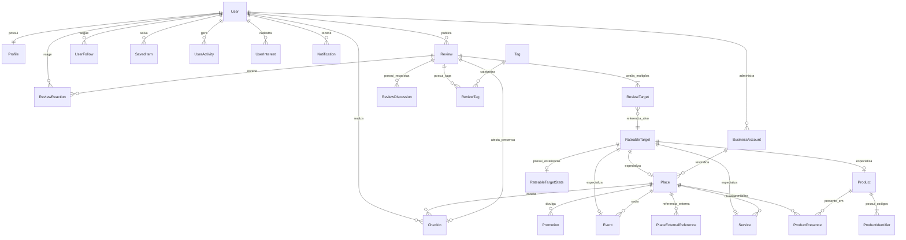

# MODELAGEM CONSOLIDADA DE DOMÍNIO (docs/domain/entities.md)

Este documento especifica a modelagem conceitual e relacional completa das entidades de domínio do **Rewit**, incorporando o padrão de integridade **RateableTarget Root (ADR-009)**, portas de referência externa e desacoplamento de estatísticas derivadas.

---

## 1. Diagrama de Relacionamento de Entidades (ERD)

---

## 2. Especificação Detalhada das Entidades

### 1. `RateableTarget` (Raiz Polimórfica de Alvos Avaliáveis - ADR-009)
- **Papel**: Identidade canônica no banco de dados para qualquer entidade que possa receber avaliações.
- **Campos**: `id` (UUIDv4), `target_type` (`PLACE`, `PRODUCT`, `SERVICE`, `EVENT`), `created_at`.
- **Invariante**: Garante chave estrangeira física e integridade referencial estrita em `review_targets`.

### 2. `RateableTargetStats` (Métricas e Médias Derivadas)
- **Papel**: Armazena as estatísticas agregadas de avaliações de forma desacoplada da tabela de cadastro da entidade.
- **Campos**: `target_id` (PK / FK para `rateable_targets.id`), `average_rating` (0.00 a 5.00), `reviews_count`, `last_calculated_at`.
- **Regra**: Médias de notas **nunca** são mantidas como colunas mutáveis soltas em `Place` ou `Product`.

### 3. `User` (Identidade e Autenticação Interna)
- **Papel**: Conta de usuário interna da plataforma.
- **Campos**: `id` (UUID próprio nosso), `email` (único), `password_hash` (nulo em logins de provedor), `auth_provider` (`LOCAL`, `GOOGLE`, `APPLE`), `provider_user_id`, `is_active`, `is_verified`, `created_at`, `updated_at`.
- **Regra**: O Google user ID nunca é chave primária interna.

### 4. `Profile` (Perfil Público e Social)
- **Papel**: Apresentação pública do usuário na rede social.
- **Campos**: `id`, `user_id` (1:1 com User), `handle` (ex: `@joaosilva`, único), `display_name`, `bio`, `avatar_url`, `reputation_score` (numérico acumulado por mérito), `is_anonymous_default`, `created_at`, `updated_at`.

### 5. `Place` (Local Físico / Estabelecimento)
- **Papel**: Ponto geográfico real (restaurante, parque, loja, praça, hotel, etc.). Herda `RateableTarget`.
- **Campos**: `id` (FK `rateable_targets.id`), `name`, `slug` (único), `category`, `description`, `address_text`, `city`, `state`, `country`, `coordinates` (`GEOGRAPHY(Point, 4326)` com índice GiST), `validation_radius_meters` (raio configurável, default 50m), `origin` (`USER`, `GOOGLE`, `IMPORT`), `is_verified`, `claimed_by_business_id`, `status`, `created_at`, `updated_at`.
- **Regra**: Não se presume que todo local é empresa. Suporta pontos turísticos e praças públicas.

### 6. `PlaceExternalReference` (Referências de Provedores Externos)
- **Papel**: Armazena IDs de serviços externos (ex: Google Places `place_id`, OSM ID) sem poluir o domínio ou espelhar bancos inteiros.
- **Campos**: `id`, `place_id` (FK `places.id`), `provider` (`GOOGLE`, `OPEN_STREET_MAP`), `external_id`, `metadata_json`, `created_at`. Unique constraint `(provider, external_id)`.

### 7. `Product` (Catálogo Global de Produtos)
- **Papel**: Produto universal padronizado, independente de onde é comercializado. Herda `RateableTarget`.
- **Campos**: `id` (FK `rateable_targets.id`), `name`, `brand`, `model`, `description`, `category`, `image_url`, `status`, `created_at`, `updated_at`.

### 8. `ProductIdentifier` (Identificadores Estruturados)
- **Papel**: Estruturação de códigos de barras (EAN-13, UPC, GTIN, ISBN).
- **Campos**: `id`, `product_id` (FK `products.id`), `identifier_type` (`EAN`, `UPC`, `GTIN`, `ISBN`), `identifier_value`, `created_at`. Unique constraint `(identifier_type, identifier_value)`.

### 9. `ProductPresence` (Presença de Produto em Estabelecimento)
- **Papel**: Relacionamento temporal atestando que determinado produto é comercializado em determinado local.
- **Campos**: `id`, `product_id`, `place_id`, `first_discovered_at`, `last_confirmed_at`, `reported_by_user_id`, `verification_status` (`UNCONFIRMED`, `VERIFIED`), `status` (`AVAILABLE`, `OUT_OF_STOCK`), `created_at`. Unique `(product_id, place_id)`.

### 10. `Service` (Serviços Associados ao Local)
- **Papel**: Atendimento, delivery, drive-thru, Wi-Fi, estacionamento, etc. Herda `RateableTarget`.
- **Campos**: `id` (FK `rateable_targets.id`), `place_id` (FK `places.id`), `name`, `category`, `description`, `status`, `created_at`, `updated_at`.

### 11. `Event` (Evento Temporal em Local)
- **Papel**: Acontecimentos com janela de vigência (shows, exposições, feiras). Herda `RateableTarget`.
- **Campos**: `id` (FK `rateable_targets.id`), `place_id` (FK `places.id`), `title`, `description`, `category`, `start_at`, `end_at`, `status` (`SCHEDULED`, `HAPPENING_NOW`, `FINISHED`, `CANCELLED`), `images` (array), `created_at`, `updated_at`. Constraint: `end_at >= start_at`.

### 12. `Review` (Publicação Social de Avaliação)
- **Papel**: Post agregador de opinião social.
- **Campos**: `id`, `user_id`, `context_place_id` (FK `places.id` opcional, indicando onde ocorreu a experiência), `experience_text`, `is_anonymous`, `is_verified_on_site`, `user_coordinates` (`GEOGRAPHY(Point, 4326)` opcional), `location_accuracy_meters`, `status` (`ACTIVE`, `UNDER_REVIEW`, `REMOVED`), `visibility`, `created_at`, `updated_at`.
- **Regra**: Pode existir sem coordenadas GPS. Pode apontar para `context_place_id` mesmo em postagem remota.

### 13. `ReviewTarget` (Alvo Específico Avaliado)
- **Papel**: Cada nota individual atribuída dentro da publicação (ADR-006 / ADR-009).
- **Campos**: `id`, `review_id` (FK `reviews.id`), `target_id` (FK `rateable_targets.id`), `rating` (1.0 a 5.0), `specific_comment`, `created_at`. Unique `(review_id, target_id)`.

### 14. `CheckIn` (Comprovação Presencial Verificada)
- **Papel**: Atestado de presença física verificada via PostGIS dentro do raio de tolerância do local.
- **Campos**: `id`, `review_id` (FK `reviews.id` 1:1), `user_id`, `place_id`, `coordinates` (`GEOGRAPHY(Point, 4326)`), `distance_to_centroid_meters`, `status` (`PENDING`, `VERIFIED`, `REJECTED`), `verified_at`.
- **Regra**: Nunca existe isolado. Só nasce a partir de uma `Review`.

### 15. `ReviewReaction` (Reações Comunitárias)
- **Papel**: Votos sociais (destaque para `HELPFUL`).
- **Campos**: `id`, `review_id`, `user_id`, `reaction_type` (`HELPFUL`), `created_at`. Unique `(review_id, user_id, reaction_type)`.

### 16. `ReviewDiscussion` (Discussões e Respostas)
- **Papel**: Fórum de debate e respostas oficiais de proprietários ou usuários à avaliação.
- **Campos**: `id`, `review_id`, `user_id`, `parent_id` (auto-relacionamento para threads), `content`, `is_from_owner`, `status`, `created_at`, `updated_at`.

### 17. `Tag` e `ReviewTag` (Taxonomia Contextual de Experiência)
- **Papel**: Categorização semântica (ATENDIMENTO, QUALIDADE, PRECO, AMBIENTE, LIMPEZA, etc.).
- **Campos `Tag`**: `id`, `code` (único), `display_name`, `category`, `created_at`.
- **Campos `ReviewTag`**: `id`, `review_id`, `tag_id`, `source` (`USER`, `RULE`, `AI`, `MODERATOR`), `confidence` (0.00 a 1.00), `created_at`. Unique `(review_id, tag_id)`.

### 18. `UserInterest` (Interesses de Usuário)
- **Papel**: Afinidades temáticas selecionadas no perfil (Tecnologia, Gastronomia, Games).
- **Campos**: `id`, `user_id`, `interest_name`, `category_code`, `created_at`. Unique `(user_id, category_code)`.

### 19. `UserActivity` (Eventos Comportamentais)
- **Papel**: Telemetria para aprendizado de máquina e recomendação sem rastreamento contínuo.
- **Campos**: `id`, `user_id`, `activity_type` (`SEARCH`, `VIEW_PLACE`, `VIEW_PRODUCT`, `CHECK_IN`, etc.), `target_type`, `target_id`, `metadata_json`, `created_at`.

### 20. `SavedItem` (Favoritos Polimórficos)
- **Papel**: Conteúdos salvos pelo usuário para leitura posterior.
- **Campos**: `id`, `user_id`, `target_id`, `item_type` (`REVIEW`, `PLACE`, `PRODUCT`, `SERVICE`, `EVENT`), `folder_name`, `created_at`. Unique `(user_id, target_id, item_type)`.

### 21. `UserFollow` (Grafo Social)
- **Papel**: Relações de seguidores na rede.
- **Campos**: `id`, `follower_user_id`, `followed_user_id`, `created_at`. Constraint: `follower_user_id <> followed_user_id`.

### 22. `Notification` (Notificações Internas)
- **Papel**: Avisos in-app e histórico de notificações.
- **Campos**: `id`, `user_id`, `notification_type`, `title`, `content`, `action_url`, `read_at`, `created_at`.

### 23. `BusinessAccount` (Contas Comerciais)
- **Papel**: Perfil jurídico de gestão de estabelecimentos físicos.
- **Campos**: `id`, `user_id`, `corporate_name`, `tax_id` (CNPJ/Tax ID único), `verification_status`, `plan_tier`, `created_at`, `updated_at`.

### 24. `Promotion` (Divulgações Comerciais)
- **Papel**: Campanhas e cupons de desconto temporais vinculados a um Place.
- **Campos**: `id`, `place_id`, `business_account_id`, `title`, `description`, `discount_code`, `start_at`, `end_at`, `is_active`, `created_at`, `updated_at`. Constraint: `end_at >= start_at`.
