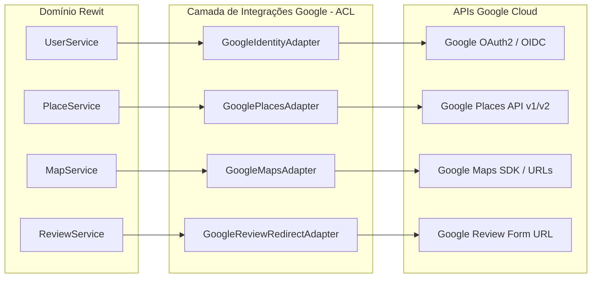

# ESTRATÉGIA DE INTEGRAÇÃO COM GOOGLE (docs/integrations/google-strategy.md)

Este documento estabelece formalmente os limites, contratos e arquitetura da camada de integração com serviços do **Google** no ecossistema Rewit.

---

## 1. Princípio de Não-Dependência e Anti-Corrupção

O Google **não** é o banco de dados do Rewit. Todas as integrações com APIs do Google residem exclusivamente no pacote:
```
com.rewit.integrations.google
├── identity/
├── places/
├── maps/
└── reviews/
```

### Regras Mandatórias:
1. **Nenhum tipo de dado do SDK do Google** pode vazar para os pacotes `domain` ou `application`.
2. A aplicação conversa apenas com interfaces neutras do Rewit (ex: `PlaceDiscoveryService`, `OAuthIdentityValidator`).
3. O adapter é responsável por instanciar a requisição externa, receber o JSON do Google, tratar códigos de erro e converter a resposta para entidades ou DTOs próprios do Rewit.

---

## 2. Divisão por Módulos de Integração



### 1. `google/identity` (Autenticação e Identidade)
- **Função**: Validar tokens de identidade OpenID Connect (ID Token) emitidos pelo Google Sign-In no aplicativo móvel.
- **Fluxo**:
  1. O app Flutter solicita login ao usuário via SDK Google Sign-In nativo.
  2. O app obtém o `idToken` criptografado e o envia ao backend Rewit via `/api/v1/auth/google`.
  3. O `GoogleIdentityAdapter` valida a assinatura do token usando as chaves públicas da Google (`GoogleIdTokenVerifier`).
  4. Extrai `email`, `name`, `sub` (Google User ID) e avatar.
  5. Vincula a um `User` interno ou provisiona um novo usuário em nossa base PostgreSQL.

### 2. `google/places` (Descoberta e Auxílio Inicial)
- **Função**: Atuar como mecanismo de *bootstrap* para povoamento inicial de novos locais em regiões geográficas onde a base do Rewit ainda tem poucos registros cadastrados.
- **Regras de Limitação e Termos**:
  - Proibido executar scripts de download em massa (scraping).
  - A consulta externa só é disparada se uma busca local no PostGIS retornar menos que o limite desejado de locais (`MIN_LOCAL_RESULTS_THRESHOLD`).
  - Quando um usuário seleciona um local sugerido pelo Google para avaliá-lo, o Rewit persiste o local em sua própria tabela `places`, associando o `google_place_id` como metadado de enriquecimento.

### 3. `google/maps` (Mapas e Navegação)
- **Função**: Fornecer utilitários de exibição geográfica e abertura de rotas de navegação.
- **Fluxo**:
  - Geração de URLs canônicas universais para abrir o aplicativo nativo de mapas do celular (Google Maps / Apple Maps) com as coordenadas de destino salvas em nosso PostGIS:
    `https://www.google.com/maps/search/?api=1&query={lat},{lng}`.

### 4. `google/reviews` (Integração Assistida de Avaliações)
- **Função**: Oferecer ponte opcional e assistida caso o usuário deseje também avaliar o estabelecimento no ecossistema oficial do Google.
- **Decisão Crítica**:
  - O Rewit **não** realiza postagem automatizada na conta do Google do usuário em segundo plano (o que violaria os termos de privacidade e autenticação da Google e geraria risco de banimento de credenciais).
  - O sistema gera um link direto de avaliação oficial da empresa (`https://search.google.com/local/writereview?placeid={google_place_id}`), permitindo que o usuário abra a interface oficial se desejar.

---

## 3. Configuração de Credenciais

Todas as credenciais são gerenciadas através de variáveis de ambiente:
```properties
GOOGLE_CLIENT_ID=
GOOGLE_CLIENT_SECRET=
GOOGLE_MAPS_API_KEY=
GOOGLE_PLACES_API_KEY=
```
Em ambiente de testes e desenvolvimento local, o sistema deve fornecer uma implementação mock (`MockGooglePlacesAdapter`) para permitir que o backend inicie e passe em testes mesmo na ausência de chaves de API pagas.
